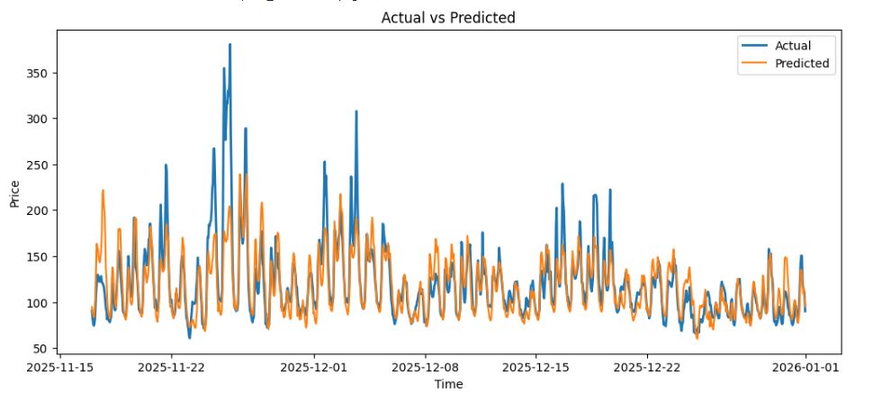
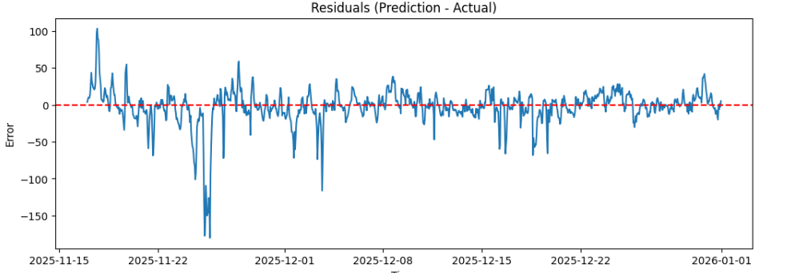

# Hungarian Day-Ahead Electricity Price Forecasting

## 1. Project Overview

This pipeline produces 24-hour-ahead point forecasts of Hungarian day-ahead electricity prices (HUPX), one **ElasticNet** model per delivery hour, using the three provided exogenous features alongside engineered calendar and lag features.

ElasticNet was chosen for four reasons:

- **Data efficiency.** A regularised linear model generalises well on a few years of hourly data where tree-based or neural models would overfit or require heavy tuning.
- **Interpretability.** Coefficients can be inspected directly to verify the model is learning possible good relationships.
- **Speed.** 24 models retrained daily in a walk-forward loop complete very fast.
- **Structure fits the model.** Strong regular seasonality which can be encoded as linear features — intraday shape, weekday effects and etc.

---

## 2. Quickstart

```bash
conda create --name <env_name> python=3.11
conda activate <env_name>

pip install -r requirements.txt

python main.py
```

---

## 3. Data & Feature Engineering

### DST Handling

Hungarian electricity data follows CET, which creates irregularities at DST transitions: 23-hour days (spring) produce a missing hour that was **linearly interpolated**; 25-hour days (autumn) produce a duplicate hour where the **second occurrence was discarded**. This ensures a clean, evenly-spaced hourly index throughout.

### Engineered Features

**Demand-solar interaction** — `demand_minus_solar` captures the net load that must be served by dispatchable generation, since solar directly offsets demand. 

**Calendar features** — day of week, `is_weekend`, and month(Fourier). Weekend and intraday price shapes are structurally different and encode cleanly as linear features.Hourly structure is modeled using 24 distinct representations per day.

**Fourier features** — sine/cosine pairs over the monthly cycle to represent smooth seasonal variation without requiring the model to infer it from calendar dummies alone.

**Lags** — 24h, 48h, and 168h lags for both the target and all exogenous features. Horizons were chosen to align with the same hour on the previous day, two days prior, and the same weekday last week. All lag choices respect the forecast horizon to prevent leakage.

**Rolling statistics** — 24h and 168h windows: mean, std, min, max. Same-hour-7d mean and std additionally capture weekday-specific level and volatility. Applied to price only.

### Target Transformation

Target was scaled with **RobustScaler** (resistant to price spikes), then transformed with **arcsinh** — equivalent to log for large positive values but well-defined for negative prices. [Chęć, Uniejewski & Weron – Electricity price seasonality forecasting paper (WUST).]

### Input Scaling

All features scaled with **RobustScaler** for the same reason — extreme spike values might otherwise dominate ElasticNet's regularisation.

### Missing Values

NaNs introduced by lagging and rolling were dropped. These fall exclusively in the first week of the dataset — old, sparse, and negligible relative to total data size.

### Reshaping

Raw data is hourly `(timesteps × features)`. Before modelling, it is reshaped to `(days × features)`, where each of the 24 ElasticNet models sees one row per day and is trained and evaluated independently.

---

## 4. Model Choice & Reasoning

The core model is **ElasticNet** — a regularised linear regression with both L1 and L2 penalties — making this an **autoregressive model with exogenous features**, where past prices and external signals enter as engineered lag and rolling features rather than through a dedicated AR structure.

**Why ElasticNet:**

- **Structure fits the model.** Seasonality is already explicitly encoded through Fourier terms, calendar features, and same-hour lags — leaving the model to learn residual linear relationships rather than discover structure from scratch.
- **24 separate models.** One model per delivery hour means each model specialises in its hour's dynamics — midday solar suppression, morning ramp, overnight baseload. This cleanly reduces variance compared to a single model handling all 24 hours at once.
- **Interpretability, speed, and data efficiency.** Coefficients are directly inspectable, 24 models retrain in seconds, and regularisation handles the moderate dataset size (~730 days) without overfitting.

**Alternatives considered:**

| Model | Outcome |
|---|---|
| **Seasonal naive** (same hour 7 days prior) | Baseline — MAE ~ 24.9. Useful floor to beat. |
| **LightGBM** | Strong on tabular data in general, but MAE was worse than ElasticNet here, and a single LightGBM quite time.  | — MAE ~ 17.3 |
| **Neural network** | Poor fit — only ~730 training days, 24 simultaneous outputs, and high computational cost. Simpler models were strongly favoured. |

ElasticNet outperforming LightGBM is consistent with the electricity price forecasting literature, where regularised linear models can remain state-of-the-art on well-engineered feature sets.[Chęć, Uniejewski & Weron – Electricity price seasonality forecasting paper (WUST).]

---

## 5. Validation Strategy

The dataset is split into three consecutive temporal blocks:

```
|——————— Train ———————|——— Validation (45 days) ———|——— Test (45 days) ———|
```

**Why 45 days?** Large enough to cover stable price conditions across several weeks and capture weekday/weekend cycles reliably, but short enough to avoid spanning a full season.

**Why not random split?** Electricity prices are sequentially correlated and a random split does not respect the time axis strictly.

**Walk-forward evaluation** is used for both validation and test periods. On each day *d*:

1. Retrain on all data up to day *d*
2. Forecast the 24 hours of day *d+1*
3. Record errors, retrain all data up to day *d+1*, forecast *d+2* and etc.

This expanding window mirrors production well. The model sees more data as time progresses, and yesterday's realised price feeds into today's lag features. Retraining daily is important precisely because the 24h and 48h lags can make the most recent observation highly influential. Also forecasting daily is usual.

**Validation vs test distinction** — hyperparameters (ElasticNet α and l1-ratio) should be tuned based on validation period errors only. The test period should be touched once, at the very end, to report the final score. 

---

## 6. Results & Error Metrics

**Metrics used:** MAE and RMSE. A lot of papers use these, with MAE being main one, since it shows the average absolute forecasting error in €/MWh and treats all deviations equally as well as easy to interpret since absolute values. RMSE complements MAE by penalising large errors more heavily, making it sensitive to price spikes, which shows how the model performing under extreme conditions. For relative metric, to see in percenteges, usually MAPE used,however, for prices in electricy market, MAPE was excluded because it behaves poorly when true values are near or at zero, which occurs quie frequent in this dataset .

| Period | MAE | RMSE |
|---|---|---|
| Test | `14.56` | `24.76` |

Given the price range of roughly €60–350/MWh, the achieved MAE represents a reasonable forecast error — the model captures the dominant patterns without huge deviations u.

**Plot — Predicted vs Actual (Test Period)**

The plot reveals several characteristics of model behaviour:


- **Main patterns are well captured** — intraday shape, weekday structure, and general price level track closely throughout most of the test period except for the spike.
- **One spike event dominates the error.** Removing this single episode, MAE would likely fall to around 7–8 €/MWh.

**Plot — Residuals (Test Period)**



- **Residuals are approximately zero-centred** — indicating almost no systematic bias in either direction.
- **Model stabilises after the spike** — suggesting the expanding window absorbs the shock and recovers, rather than remaining persistently miscalibrated.


---

## 7. Limitations & Failure Modes

**Spike events.** The model struggles with sharp, short-timewise price spikes — as visible in the test period around November. After some readingthis coincided with an unusually cold period, where heating demand probably pushed prices far outside the normal range. 

**Missing features.** The provided feature set covers demand and solar, but European electricity prices are also strongly driven by Wind generation, Gas prices, Tempreature, Weather

Adding these can have a high impact on the current model.

**Data size.** ~730 days is modest. The ElasticNet handles this well, but limits the ability to model rare regimes  that appear only a handful of times in the training history. With several additional years of data, more expressive models — such as LSTMs, which have shown strong performance in electricity price forecasting — can be very good especially because of ability to learn non-linear relationships and also the outputs are related and can affect each other.

**Static feature set.** The model has no ability to detect or adapt to structural market changes (like new behaviour) other than gradually through the expanding walk-forward window.

---

## 8. Code Structure

```
src/
  data.py         # data loading, converting to CET, DST handling
  features.py     # feature engineering, scaling, target transformation, splitting
  model.py        # defines train/validation and test sizes, walk-forward loop: expanding window retraining, TimeSeriesSplit for hyperparameter tuning and evaluation
  evaluate.py     # metrics, plots
main.py           # calls src modules in order
requirements.txt      # dependencies
results/              # scores/plots
```